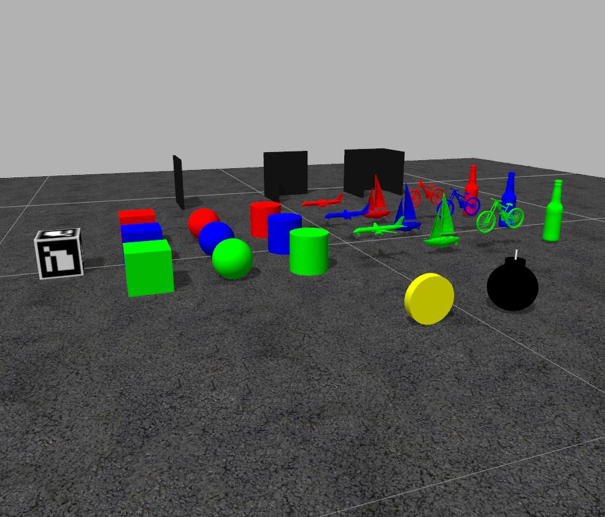

# LABORATORIO DE AUTOMÁTICA Y ROBÓTICA

### Paquete labrob_gazebo
* * *

Para usar el mundo de Gazebo del paquete 'labrob_gazebo' sigue los siguientes pasos:

 * Copia este paquete (carpeta labrob_gazebo con todo su contenido) en tu espacio de trabajo (catkin_ws).

 * Configura la variable de entorno GAZEBO_MODEL_PATH para indicar que los modelos de Gazebo se carguen desde el directorio 'models' del propio paquete. Para ello, incluye la siguiente línea en tu .bashrc:

    `export GAZEBO_MODEL_PATH=$GAZEBO_MODEL_PATH:~/catkin_ws/src/labrob_gazebo/models`

 * Lanza el mundo en Gazebo
 
    `roslaunch labrob_gazebo labrob.launch`
    
    
### Curso ROS - Ubicación de cada archivo
* * * 

* my_robot_0X : ~/.gazebo/models
* kinect_ros : ~/.gazebo/models
* pioneer3at_ros : ~/.gazebo/models
* pioneer3at_ros_kinect : ~/.gazebo/models
* myworldgazebo: ~/catkin_ws/src
